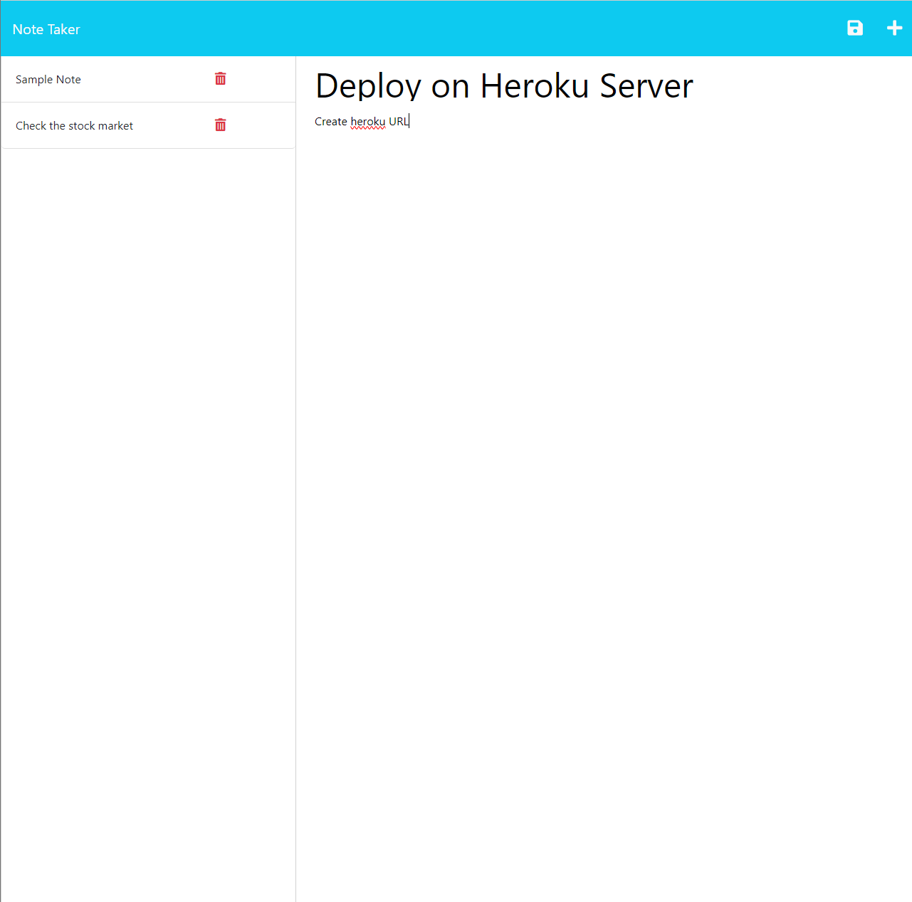
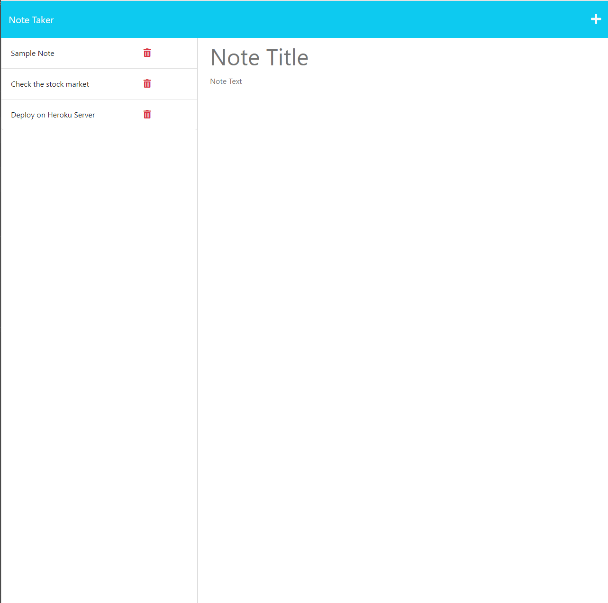

# Express-Note-Taker

<div align="center">
  
</div>

## Table of Contents

- [Description](#description)
- [Installation](#installation)
- [Usage](#usage)
- [Deployed-URL](#deployed-url)
- [License](#license)
- [Contributing](#contributing)
- [Tests](#tests)
- [Questions](#questions)

## Description

- **Effortless Access:** When you open the Note Taker, you're greeted by a clean landing page that provides a straightforward link to access your notes.

- **Intuitive Notes Page:** Clicking on the link leads you to a well-organized notes page. On the left-hand side, you'll find a list of existing notes, while the right-hand side offers empty fields to enter a new note title and its corresponding text.

- **Smart Saving:** Upon entering a new note title and its text, a Save icon promptly appears in the top navigation. This feature ensures your ideas are securely stored.

- **Seamless Integration:** Clicking the Save icon saves your new note, seamlessly integrating it into the collection alongside your existing notes.

- **Efficient Navigation:** Navigating between notes is a breeze. Click on an existing note in the left-hand column, and it instantly appears in the right-hand column for quick reference.

- **Swift Note Creation:** Need to jot down a new idea? Click on the Write icon in the navigation, and you'll be presented with empty fields to enter a new note title and text.

- **Simple Deletion:** Should you want to remove a note, simply click on the trash can icon next to it. This action will promptly delete the individual note.

- **Wildcard Route:** This application includes a wildcard route directing to the index.html, ensuring smooth functionality.

- **Deployment:** You can access the deployed application on Heroku via *https://salty-chamber-08648-79fa759e30bc.herokuapp.com/*.

## Installation

Clone the repository to your local machine

```sh
1. git clone https://github.com/dmerk2/Express-Note-Taker.git
```

Install dependencies and start the local server

```sh
2. npm i && node server.js
```

Open your web browser and go to **http://localhost:3001** to access the Express Note Taker

## Usage




## Deployed URL

Click the lightning bolt [⚡](https://salty-chamber-08648-79fa759e30bc.herokuapp.com/) to use the Express Note Taker deployed on Heroku.

## License

This project is licensed under the terms of the **[MIT License](https://opensource.org/licenses/MIT)**

## Contributing

Daniel Merkin

## Tests

N/A

## Questions

If you have any questions or suggestions about this project, please feel free to contact me:

- GitHub: [@dmerk2](https://github.com/dmerk2)
- Email: dan.merkin@gmail.com
